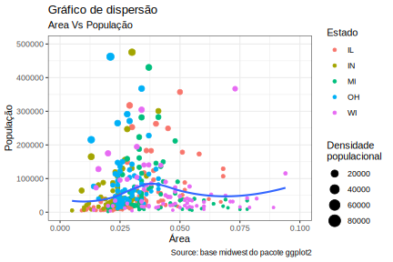

```{r setup, include=FALSE}
knitr::opts_chunk$set(echo = FALSE, fig.cap = TRUE,
                      fig.cap.style = "Figure",
                      fig.cap.pre = "Figura ",
                      fig.cap.sep = ": ",
                      tab.cap.style = "Table Caption",
                      tab.cap.pre = "Tabela ",
                      tab.cap.sep = ": ")
library(officedown)
library(ggplot2)
```

## Lista de conteúdos {#id-dash}

<!---BLOCK_TOC--->

## Lista de figuras

<!---BLOCK_TOC{seq_id: 'fig'}--->

## Lista de tabelas

<!---BLOCK_TOC{seq_id: 'tab'}--->

## Tabelas

```{r tab.cap="Primeiras linhas da tabela mtcars, do pacote datasets.", tab.id="mtcars"}
head(mtcars)
```

## Referências automáticas

Posso referenciar uma figura assim: \@ref(fig:boxplot) e uma tabela assim: \@ref(tab:mtcars).

## Figuras

### Criando um ggplot

Colocar um ggplot2 no word é razoavelmente fácil. 

Uma versão com resolução mais baixa:

```{r fig.width=6, fig.cap="Gráfico de dispersão que compara a área e a população de municípios do meio-oestes estadunidense.", fig.id = "boxplot", echo = FALSE, message=FALSE, warning=FALSE}

options(scipen=999)  # turn-off scientific notation like 1e+48
library(ggplot2)
theme_set(theme_bw())  # pre-set the bw theme.
data("midwest", package = "ggplot2")
# midwest <- read.csv("http://goo.gl/G1K41K")  # bkup data source

# Scatterplot
gg <- ggplot(midwest, aes(x=area, y=poptotal)) + 
  geom_point(aes(col=state, size=popdensity)) + 
  geom_smooth(method="loess", se=F) + 
  xlim(c(0, 0.1)) + 
  ylim(c(0, 500000)) + 
  labs(subtitle="Area Vs População", 
       y="População", 
       x="Área", 
       title="Gráfico de dispersão", 
       caption = "Source: base midwest do pacote ggplot2",
       size = "Densidade\npopulacional",
       col = "Estado")

ggplot2::ggsave("arquivo.svg", gg)
```

```{r fig.width=6, fig.cap="Gráfico de dispersão que compara a área e a população de municípios do meio-oestes estadunidense.", fig.id = "boxplot", echo = FALSE, message=FALSE, warning=FALSE}

options(scipen=999)  # turn-off scientific notation like 1e+48
library(ggplot2)
theme_set(theme_bw())  # pre-set the bw theme.
data("midwest", package = "ggplot2")
# midwest <- read.csv("http://goo.gl/G1K41K")  # bkup data source

# Scatterplot
gg <- ggplot(midwest, aes(x=area, y=poptotal)) + 
  geom_point(aes(col=state, size=popdensity)) + 
  geom_smooth(method="loess", se=F) + 
  xlim(c(0, 0.1)) + 
  ylim(c(0, 500000)) + 
  labs(subtitle="Area Vs População", 
       y="População", 
       x="Área", 
       title="Gráfico de dispersão", 
       caption = "Source: base midwest do pacote ggplot2",
       size = "Densidade\npopulacional",
       col = "Estado")

gg
```

Versão com resolução mais alta (parâmetro `dpi=300`)

```{r fig.width=6, fig.cap="Gráfico de dispersão que compara a área e a população de municípios do meio-oestes estadunidense.", echo = FALSE, message=FALSE, warning=FALSE, dpi=300}
gg
```


Versão vetorizada (SVG):

```{r fig.width=6, fig.cap="Gráfico de dispersão que compara a área e a população de municípios do meio-oestes estadunidense.", echo = FALSE, message=FALSE, warning=FALSE}
ggplot2::ggsave("arquivo.svg", gg)

```

## Usando o pacote flextable

O pacote `flextable` permite criar tabelas mais sofisticadas e com estilos diferentes do das tabelas padrão.

```{r tab.cap='Versão do mtcars usando o pacote flextable.', tab.id='flextable', message=FALSE, warning = FALSE, echo = FALSE, erro = FALSE}
if(require("flextable")){
  ft <- flextable(head(mtcars, n = 10))
  ft <- fontsize(ft, size = 9, part = "all")
  ft <- compose(x = ft, j = "mpg",
    value = as_paragraph(
      value = lollipop(value = mpg, min = 0, max = 30, positivecol = "#DD2233", rangecol = "#DD2233")
      ))
  ft <- compose(x = ft, j = "drat",
    value = as_paragraph(
      value = minibar(value = drat, max = 6, barcol = "#DD3322")
      ))
  ft <- compose(x = ft, j = "qsec",
    value = as_paragraph(
      value = linerange(value = qsec)
      ))
  ft <- set_table_properties(ft, layout = "autofit")
  ft
  }
```

