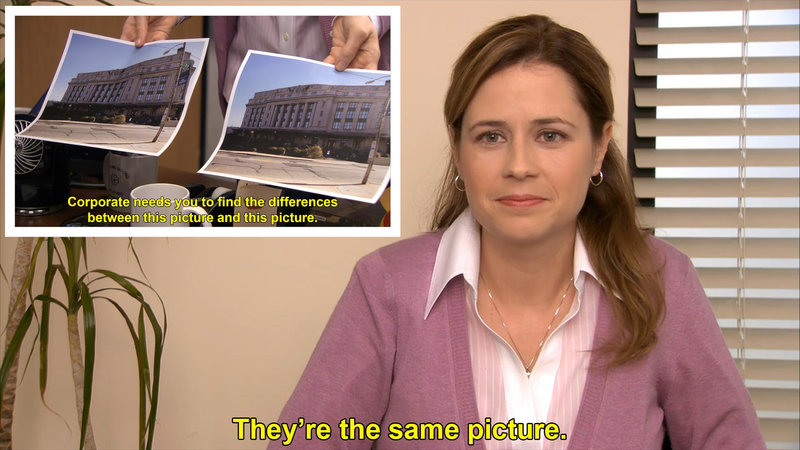

```{r setup, include=FALSE}
library(ggplot2)
knitr::opts_chunk$set(
  echo = FALSE, 
  fig.align='center'
)
xaringanExtra::use_panelset()
```


# Objetivos de aprendizagem

⬜ Discutir os principais aspectos visuais a serem considerados em um gráfico estatístico

--

⬜ Compreender como modificar um `ggplot` para comunicar resultados de maneira eficiente.

--

⬜ Otimizar um gráfico que utilizamos na aula anterior.

---

# O que é otimização visual?

- É o ato de trabalhar em uma visualização aprimorar a comunicação.

- Pode envolver alterações nas cores, fontes, elementos geométricos, entre outros, a partir de um gráfico exploratório.

- Não é uma ciência exata, mas recolhe elementos da ciência para aumentar a probabilidade de sucesso da visualização.

---

# Recursos pré-atentativos

- Uma propriedade visual pré-atentativa é processada pelo nosso [cérebro antes de uma ação consciente](https://www.interaction-design.org/literature/article/preattentive-visual-properties-and-how-to-use-them-in-information-visualization).

- Como isso esse processamento é muito rápido, trata-se de uma oportunidade para tornar visualizações mais amigáveis e diretamente interpretadas.

- Segundo [Colin Ware](https://en.wikipedia.org/wiki/Colin_Ware), existem 4 propriedades pré-atentativas que podemos explorar:
    - Cor
    - Forma
    - Movimento
    - Posicionamento
    
- O objetivo dos recursos pré-atentativos é __<span style="color:blue;">chamar a atenção</span>__.

---

# Recursos pré-atentativos

- Uma propriedade visual pré-atentativa é processada pelo nosso [cérebro antes de uma ação consciente](https://www.interaction-design.org/literature/article/preattentive-visual-properties-and-how-to-use-them-in-information-visualization).

- Como isso esse processamento é muito rápido, trata-se de uma oportunidade para tornar visualizações mais amigáveis e diretamente interpretadas.

- Segundo [Colin Ware](https://en.wikipedia.org/wiki/Colin_Ware), existem 4 propriedades pré-atentativas que podemos explorar:
    - __Cor__
    - __Forma__
    - Movimento
    - Posicionamento
    
- O objetivo dos recursos pré-atentativos é __<span style="color:blue;">chamar a atenção</span>__.


---
class: middle, center, inverse

# Cor

---

# Cores do zero: HCL vs RGB

- HCL (hue, chroma, luminance) é vantajoso pois é mais intuitivo de criar do que RGB, já que o HCL tem apenas um eixo de cores (*hue*), enquanto RGB é uma composição de três (*red*, *green*, *blue*)

- O pacote `{colorspace}` permite usar HCL para definir uma cor/paleta: experimente `colorspace::hcl_color_picker()`

- [Nesse site](https://color.adobe.com/create/color-wheel), também é possível criar algumas paletas

```{r, out.width="70%"}
knitr::include_graphics("img/hcl.png")
```

---

# Paletas de cores prontas

- __Escalas qualitativas__: utilizado para variáveis nominais (sexo, cor/raça)

- __Escalas divergentes__: utilizado para variáveis que têm um centro neutro (favorável/neutro/desfavorável, correlação)

- __Escalas sequenciais__: utilizado para variáveis ordinais (faixa etária, renda)

- __Viridis__: útil para comunicar com pessoas com daltonismo

---

# Paletas de cores no {ggplot2}

- `scale_*_brewer()`: utilizada para variáveis discretas. Possui três tipos: divergente, qualitativa e sequencial.

- `scale_*_distiller()`: utilizada para variáveis contínuas. Interpola as cores do *brewer* para lidar com todos os valores.

- `scale_*_fermenter()`: utilizada para variáveis contínuas, que são transformadas em discretas (binned).

- `scale_*_viridis_[cdb]`: Escala viridis para variáveis `c`ontínuas, `d`iscretas ou `b`inned.

- `scale_*_manual()`: inclui um conjunto de cores manualmente.

---

# Paletas de outros pacotes

- [`{ggthemr}`](https://github.com/Mikata-Project/ggthemr) tem um monte de paletas, mas está um pouco desatualizado.

- [`{hrbrthemes}`](https://github.com/hrbrmstr/hrbrthemes) contém uma lista de temas escolhidos pelo Bob Rudis.

- [`{ghibli}`](https://ewenme.github.io/ghibli/) tem paletas de cores relacionadas ao Studio Ghibli

- [`{paletteer}`](https://github.com/EmilHvitfeldt/paletteer) tem uma coleção de cores de vários outros pacotes de paletas.

---

# Qual visualização é melhor?

.pull-left[

```{r, fig.width=5, fig.height=4, dpi = 300}
notas_pixar <- dados::pixar_avalicao_publico |> 
  dplyr::count(nota_cinema_score) |> 
  dplyr::mutate(
    nota = forcats::fct_explicit_na(nota_cinema_score, "(vazio)"),
    nota = forcats::fct_relevel(nota, c("A-", "A", "A+", "(vazio)"))
  )
notas_pixar |> 
  ggplot2::ggplot() +
  ggplot2::aes(nota, n) +
  ggplot2::geom_col(width = .5) +
  ggplot2::scale_y_continuous(limits = c(0, 15)) +
  ggplot2::labs(title = "A maioria dos filmes da pixar têm nota 'A'") +
  ggplot2::theme_minimal(12)
```

]


.pull-right[

```{r, fig.width=5, fig.height=4, dpi = 300}
notas_pixar |> 
  dplyr::mutate(cor = dplyr::case_when(
    nota == "A" ~ "b",
    TRUE ~ "a"
  )) |> 
  ggplot2::ggplot() +
  ggplot2::aes(nota, n, fill = cor) +
  ggplot2::geom_col(width = .5, show.legend = FALSE) +
  ggplot2::scale_y_continuous(limits = c(0, 15)) +
  ggplot2::scale_fill_manual(values = c("gray30", "tomato")) +
  ggplot2::labs(title = "A maioria dos filmes da pixar têm nota 'A'") +
  ggplot2::theme_minimal(12)
```

]

---

# É subjetivo...

```{r}

```


---
class: middle, center, inverse

# Forma

---

# Formas

- Geralmente queremos contrastar formas para chamar a atenção...

--

- Sem com isso fazer uma bagunça visual.

--

- A ideia é utilizar apenas um elemento, como tamanho, forma, largura, marcações, angulações, etc. para mostrar o contraste.


---

# Exemplos


```{r warning=FALSE, fig.width=9, fig.height=6, dpi=300}
p_size <- notas_pixar |> 
  dplyr::mutate(tipo = dplyr::case_when(
    nota == "A" ~ "b",
    TRUE ~ "a"
  )) |> 
  ggplot2::ggplot() +
  ggplot2::aes(nota, n, size = tipo) +
  ggplot2::geom_segment(ggplot2::aes(xend = nota, yend = 0), size = .5) +
  ggplot2::geom_point() +
  ggplot2::scale_y_continuous(limits = c(0, 15)) +
  ggplot2::scale_size_discrete(range = c(3, 6)) +
  ggplot2::theme_minimal(12) +
  ggplot2::theme(legend.position = "none")


p_shape <- notas_pixar |> 
  dplyr::mutate(tipo = dplyr::case_when(
    nota == "A" ~ "b",
    TRUE ~ "a"
  )) |> 
  ggplot2::ggplot() +
  ggplot2::aes(nota, n, shape = tipo) +
  ggplot2::geom_segment(ggplot2::aes(xend = nota, yend = 0), size = .5) +
  ggplot2::geom_point(size = 6) +
  ggplot2::scale_shape_manual(values = c(1, 16)) +
  ggplot2::scale_y_continuous(limits = c(0, 15)) +
  ggplot2::theme_minimal(12) +
  ggplot2::theme(legend.position = "none")

p_mark <- notas_pixar |> 
  dplyr::mutate(tipo = dplyr::case_when(
    nota == "A" ~ "b",
    TRUE ~ "a"
  )) |> 
  ggplot2::ggplot() +
  ggplot2::aes(nota, n, shape = tipo) +
  ggplot2::geom_segment(ggplot2::aes(xend = nota, yend = 0), size = .5) +
  ggplot2::geom_point(size = 6) +
  ggplot2::scale_shape_manual(values = c(1, 13)) +
  ggplot2::scale_y_continuous(limits = c(0, 15)) +
  ggplot2::theme_minimal(12) +
  ggplot2::theme(legend.position = "none")

p_bar <- notas_pixar |> 
  dplyr::mutate(tipo = dplyr::case_when(
    nota == "A" ~ "b",
    TRUE ~ "a"
  )) |> 
  ggplot2::ggplot() +
  ggplot2::aes(nota, n) +
  ggplot2::geom_col(width = c(.8, .5,.5,.5)) +
  ggplot2::scale_y_continuous(limits = c(0, 15)) +
  ggplot2::theme_minimal(12)

patchwork::wrap_plots(p_size, p_shape, p_mark, p_bar)

```

---

# Princípios Gestalt

- __Gestalt__ é uma área ampla da psicologia que não vamos aprofundar.

- Está ligada à ideia de que, em uma visualização, o todo é maior do que a soma das partes.

- Dois princípios Gestalt aplicáveis em visualização de dados são a nossa capacidade de:
    - Completar figuras
    - Agrupar objetos

- Ou seja, podemos criar visualizações que ativam essas capacidades.

---

# Qual visualização é melhor?

.pull-left[


```{r, fig.height=4, fig.width=6, dpi = 300}
dados::pinguins |> 
  tidyr::drop_na() |> 
  ggplot2::ggplot() +
  ggplot2::aes(
    x = comprimento_bico, 
    y = profundidade_bico, 
    shape = especie
  ) +
  ggplot2::geom_point() +
  ggplot2::theme_minimal(12) +
  ggplot2::labs() +
  ggplot2::theme(legend.position = "bottom")

```

]

.pull-right[


```{r, fig.height=4, fig.width=6, dpi = 300}
dados::pinguins |> 
  tidyr::drop_na() |> 
  ggplot2::ggplot(ggplot2::aes(
    x = comprimento_bico, 
    y = profundidade_bico, 
    shape = especie,
    group = especie
  )) +
  ggplot2::geom_point() +
  ggplot2::theme_minimal(12) +
  ggplot2::theme(legend.position = "bottom") +
  ggplot2::stat_ellipse(
    type = "norm", 
    geom = "polygon",
    alpha = .05,
    level = .95,
    colour = "transparent"
  )
```

]

---


# Vamos ao R!

```{r}
knitr::include_graphics("img/cat.gif")
```
