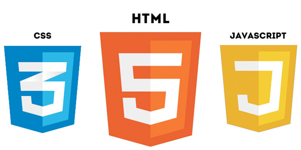
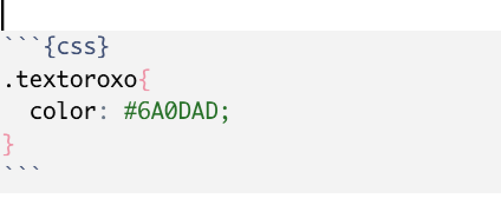

```{r setup, include=FALSE}
options(htmltools.dir.version = FALSE)

knitr::opts_chunk$set(
  fig.align = "center",
  message = FALSE,
  warning = FALSE,
  echo = FALSE
)
```

```{r echo=FALSE}
library(magrittr, include.only = "%>%")
```


```{r, child="00-preamble.Rmd"}

```

```{css}
.remark-code-line {
    min-height: 1em;
    background-color: #f8f8f8;
}
```


## Introdução

- Quando criamos um arquivo RMarkdown que gera um output em `.html`, esse arquivo `.html` é interpretado pelo navegador (ex. Chrome), utilizando também os arquivos `.css` e `.js`

  - **HTML** (HyperText Markup Language - Linguagem de Marcação de Hipertexto): é uma linguagem de marcação, é usado para estruturar páginas da internet (websites).
  
  - **CSS** (Cascading Style Sheets - Folha de Estilo em Cascata): é usado para estilizar os elementos escritos no HTML.

  - **Javascript**: é uma linguagem de programação, permite que as páginas sejam dinâmicas.
  

```{r echo=FALSE, out.width="50%", eval = TRUE}

```

---
class: 

## HTML 🧱 🏗 


- HTML descreve a estrutura de uma página web.

- HTML consiste em uma série de elementos. Estes elementos mostram para o navegador (o browser) como apresentar o conteúdo.

- Um elemento em HTML consiste em uma tag inicial, algum conteúdo que será marcado, e a tag final (que é diferente da tag inicial por possuir a barra `/` )

```
<nomedatag>Conteúdo a ser marcado vai aqui...</nomedatag>
```

- Elementos em HTML podem ter atributos de classe (`class`). As classes geralmente são usadas para referenciar um estilo.


```
<nomedatag class="nomedaclasse">
Conteúdo a ser marcado vai aqui...
</nomedatag>
```

---
class: 


### Exemplo  🧱 🏗 

.panelset[


.panel[.panel-name[Código em Markdown]

``` 
Este é o curso de **Relatórios e visualização de dados**,
oferecido pela [Curso-R](https://curso-r.com/).
```
]

.panel[.panel-name[Código HTML]

```
<p> 
Este é o curso de <b>Relatórios e visualização de dados</b>,
oferecido pela <a href='https://curso-r.com/'>Curso-R</a>.
</p> 
```
]


.panel[.panel-name[Como aparece]

<p> 
Este é o curso de <b>Relatórios e visualização de dados</b>,
oferecido pela <a href='https://curso-r.com/'>Curso-R</a>.
</p> 
]


]


---
class: 

## CSS  🎨 

- CSS é uma sigla para *Cascading Style Sheets* (tradução literal: folha de estilo em cascada).

- CSS descreve como os elementos em HTML serão apresentados.

- Você pode criar estilos no seu arquivo `.Rmd`, ou também salvar em um arquivo externo. As folhas de estilo são salvas em arquivos com a extensão `.css`.

- Você pode criar um arquivo CSS e reaproveitar em diversos arquivos HTML. 

- Criar estilos no seu arquivo `.Rmd`:
  - Colocando o estilo dentro de uma tag html `<style>` 
  - Criando um Chunk de código CSS

---
class:

### Exemplo de código CSS  🎨 

.panelset[

.panel[.panel-name[Exemplo de elementos]

- Para elementos, usamos a seguinte estrutura:

````CSS
nomedoelemento {

  propriedade: valor da propriedade;

}

````

Exemplo: 

````CSS
p {

  font-size: 20px;  

}

````
]


.panel[.panel-name[Exemplo de classe]

- Para classes, usamos a estrutura dos elementos, porém adicionando um ponto antes:

````CSS
.nomedaclasse {

  propriedade: valor da propriedade;

}

````

Exemplo: 

````CSS
.textogrande {

  font-size: 40px;  

}

````

]


]

---
class: 


### Exemplo 1 🎨 

.panelset[

.panel[.panel-name[Código HTML]

```
<style>
.textorosa{
color: pink;

}
</style>
<p> 
Este é o curso de 
<b class="textorosa">Relatórios e visualização de dados</b>,
oferecido pela <a href='https://curso-r.com/'>Curso-R</a>.
</p> 
```
]


.panel[.panel-name[Como aparece]

<style>
.textorosa{
color: pink;

}
</style>
<p> 
Este é o curso de 
<b class="textorosa">Relatórios e visualização de dados</b>,
oferecido pela <a href='https://curso-r.com/'>Curso-R</a>.
</p> 
]


]

---
class: 

### Exemplo 2  🎨 

.panelset[


.panel[.panel-name[Código em Markdown]


```{r echo=FALSE, out.width="50%", eval = TRUE, fig.align='left'}

```


``` 

Este é o curso de .textoroxo[**Relatórios e visualização de dados**],
oferecido pela [Curso-R](https://curso-r.com/).
```
]


.panel[.panel-name[Como aparece]


```{css}
.textoroxo{
  color: #6A0DAD;
}
```

Este é o curso de .textoroxo[**Relatórios e visualização de dados**],
oferecido pela [Curso-R](https://curso-r.com/).

]


]

---

## Dica de ouro 🚩

Use **muito** as ferramentas de desenvolvedor(a) do navegador.

Permite explorar o conteúdo de uma página web. 

Atalho costuma ser: **CTRL + SHIFT + C**

- [Firefox - Page inspector](https://developer.mozilla.org/pt-BR/docs/Tools/Page_Inspector)

- [Chrome](https://support.google.com/campaignmanager/answer/2828688?hl=pt-BR)


---
class:

## Referências 📖

- [Mozilla Web Docs](https://developer.mozilla.org/pt-BR/docs/Learn/Getting_started_with_the_web)

- [w3schools.com - HTML](https://www.w3schools.com/html/default.asp)

- [w3schools.com - CSS](https://www.w3schools.com/css/)


## Estudo 📚

- [Free Code Camp](https://www.freecodecamp.org/learn/responsive-web-design/)

- [Palestra do Garrick Aden-Buie: Using xaringan to learn web development](https://rstudio.com/resources/rstudioglobal-2021/xaringan-playground-using-xaringan-to-learn-web-development/)
