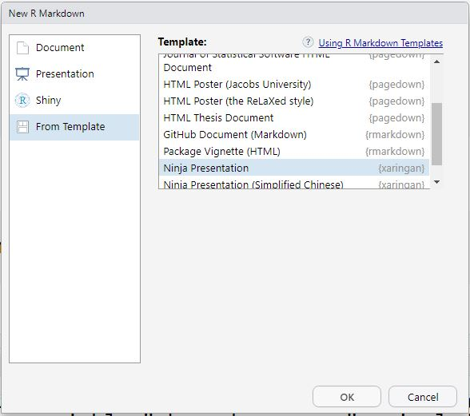
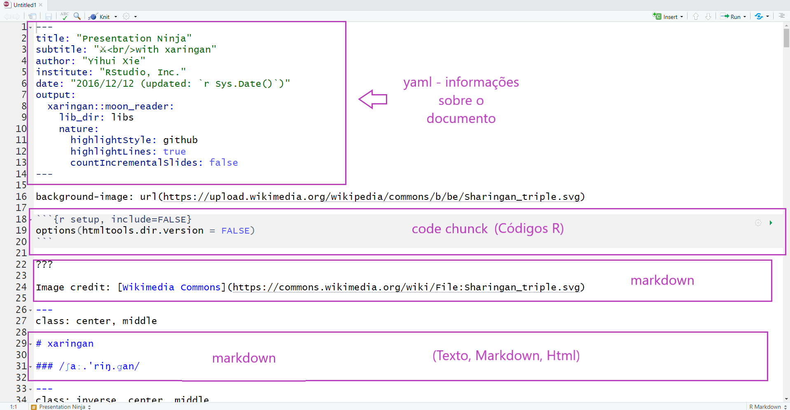
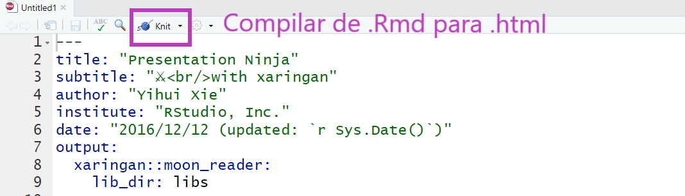

```{r setup, include=FALSE}
options(htmltools.dir.version = FALSE)

knitr::opts_chunk$set(fig.align = "center",
                      message = FALSE,
                      warning = FALSE,
                      echo = FALSE
                      )
```

```{r echo=FALSE}
library(magrittr, include.only = "%>%")
```


```{r, child="00-preamble.Rmd"}

```

class: middle, center

# .blue[Pacote {xaringan}]


---
class: 

## Pacote {xaringan}

.pull-left[

- Possibilita criar apresentações **ninjas** com `R Markdown`

- Utiliza a biblioteca `remark.js`

- Gera resultado em HTML 

- HTML pode ser convertido para PDF (estático)
]

.pull-right[

```{r, out.width="75%", fig.cap="<center><b>Logo: <a href='https://github.com/yihui/xaringan'>Pacote xaringan</a></b></center>"}
knitr::include_graphics("img/hex-xaringan.png")
```

]


---
class: 

## Estrutura da apresentação

- No `xaringan`, utilizamos o arquivo `.Rmd` para escrever o código da apresentação que é compilado para um arquivo `.html`

- Esse arquivo `.html` é interpretado pelo navegador (ex. Chrome), utilizando também os arquivos `.css` e `.js`


```{r echo=FALSE, out.width="50%", eval = TRUE}
knitr::include_graphics("img/html-css-javascript.jpg")
```


---
class: 

## Estrutura da apresentação

```{r echo=FALSE, out.width="40%", eval = TRUE}
knitr::include_graphics("img/html-css-javascript.jpg")
```

  - **HTML** (HyperText Markup Language - Linguagem de Marcação de Hipertexto): é uma linguagem de marcação, é usado para estruturar a página.

  - **CSS** (Cascading Style Sheets - Folha de Estilo em Cascata): é usado para estilizar os elementos escritos no HTML.

  - **Javascript**: é uma linguagem de programação, permite que as páginas sejam dinâmicas.

---
class: 

## O que precisa saber? 

- **HTML**: É gerado automaticamente ao compilar o `.Rmd`

- **CSS**: É usado para personalizar a parte visual da apresentação. Para saber mais sobre temas: [xaringan wiki](https://github.com/yihui/xaringan/wiki/Themes)

- **JS**: utiliza o `Remark.JS`, mas aceita outros códigos caso seja necessário.

```{r, out.width="20%"}
knitr::include_graphics("https://media1.giphy.com/media/VbnUQpnihPSIgIXuZv/giphy-downsized.gif")
```


---
class:  

## Recomendações 

- Desenvolva a apresentação em um projeto no RStudio: <br>
facilita muito para organizar os arquivos e posteriormente sincronizar com o GitHub.

- Organize o seu diretório. <br>
Por exemplo:

  - `img/` - imagens, figuras, etc.
  
  - `libs/` - bibliotecas. 
  
  - `css/` - para arquivos `.css` (opcional)
  
- `r emo::ji("bell")` **Importante**: Compile (knit) o arquivo com frequência!  

---
class: 

## Criar um arquivo R Markdown

### Com template Ninja Presentation

  - `File > New File > R Markdown...`
  
  - Na janela New R Markdown: <br> `From Template > Ninja Presentation`
  
```{r, out.width="50%"}

```


---
class:  

## Estrutura arquivo R Markdown

```{r, out.width="90%"}

```

---
class: 

## Como delimitar slides?

- No xaringan, os slides são delimitados por `---` no início da linha.

- Para fazer slides que aparecem aos poucos ( _incremental slides_ ), utilize `--` no início da linha.
<br>
<br>
Por exemplo:

--

O conteúdo 
--

aparece 
--

aos poucos!


---
class: 

## Adicionando conteúdo na apresentação

- Atualiza a apresentação enquanto é editada:

```{r echo=TRUE, eval=FALSE}
xaringan::inf_mr()
```

- Use **muito** o atalho para ir salvando seu arquivo: **CTRL + S**. Algumas coisas no preview só são atualizadas quando salvamos. 
---
class: 

# .blue[Exercícios!  Vamos ao RStudio]


```{r out.width="30%", fig.align='center'}
knitr::include_graphics("https://media.giphy.com/media/JIX9t2j0ZTN9S/giphy.gif")
```

Exercícios: no arquivo: `exercicios/xaringan/exercicio1.Rmd`

1. Crie dois slides:
  - No primeiro slide, insira um subtítulo (usando markdown) escrito:  Meu slide!
  - Adicione o gif acima no segundo slide. URL: https://media.giphy.com/media/JIX9t2j0ZTN9S/giphy.gif
  - Renderize a apresentação (apertando o botão knit) e veja o resultado!
  - No tempo restante, experimente adicionar conteúdo no seu primeiro slide usando marcações em markdown. 
  


---
class: inverse, center, middle

# Metadados da apresentação: YAML


---
class:  

## Alterar `YAML`

- O `YAML` possui informações importantes para a <br> apresentação como:
  - título;
  - subtítulo;
  - autor;
  - instituição;
  - data;
  - etc.

- __output:__ indica o formato, por exemplo html_document, pdf_document, etc.
No caso do  `xaringan`, o output é `xaringan::moon_reader`

- __libs_dir:__ pasta onde colocará bibliotecas necessárias. <br>
Por exemplo: `lib_dir: libs` indica que a biblioteca que usamos remark-latest.min.js será salva na pasta libs.
    
---

## Alterar `YAML`

- Cuidado com a identação!

```{r}
knitr::include_graphics("https://media0.giphy.com/media/xT9IgIc0lryrxvqVGM/giphy-downsized.gif")
``` 


---
class: 

## Exemplo do código `YAML`:

```{r echo=TRUE, eval=FALSE}
---
{{title: "Título da apresentação"}}
{{subtitle: "Subtítulo da apresentação"}}
{{author: "Autor"}}
{{institute: "Instituição"}}
{{date: "07/09/2019"}}
output:
  xaringan::moon_reader:
    lib_dir: libs
    nature:
      highlightStyle: github
      highlightLines: true
      countIncrementalSlides: false
---
```

- Aperte H ou ? para conferir a lista de atalhos do  `xaringan`


---
class: 

## Encoding

- Adicionar no `YAML`:

```{r echo=TRUE, eval=FALSE}
encoding: "UTF-8"
```

> "Uma **codificação de caracteres** é um padrão de relacionamento entre um conjunto de caracteres(...) com um conjunto de outra coisa, como por exemplo números ou pulsos elétricos com o objetivo de **facilitar o armazenamento de texto em computadores e sua transmissão** através de redes de telecomunicação." <br>
[Wikipedia](https://pt.wikipedia.org/wiki/Codificação_de_caracteres)

<!--"There Ain’t No Such Thing As Plain Text." <br>
[Joel Spolsky, 2003](https://www.joelonsoftware.com/2003/10/08/the-absolute-minimum-every-software-developer-absolutely-positively-must-know-about-unicode-and-character-sets-no-excuses/)
 If you have a string, in memory, in a file, or in an email message, you have to know what encoding it is in or you cannot interpret it or display it to users correctly." -->
 
---
class: 

# .blue[Exercícios!  Vamos ao RStudio]


```{r out.width="30%", fig.align='center'}
knitr::include_graphics("https://media.giphy.com/media/JIX9t2j0ZTN9S/giphy.gif")
```

Exercícios: no arquivo: `exercicios/xaringan/exercicio1.Rmd`

2. Agora vamos alterar os metadados da apresentação (YAML):

  a. Adicione um título
  
  b. Adicione um subtítulo
  
  c. Adicione seu nome no campo de autoria
  
  d. Adicione a data


---
class: 

## Biblioteca `remark.js`

- Seu uso é opcional, mas recomendado! <br>
Possibilita que sua apresentação seja **visualizada offline**!


- Duas opções para fazer download da biblioteca `remark.js`:
<br><br>
  - A função `xaringan::summon_remark()` faz o download da versão mais atual do `remark.js` e salva na pasta `/libs`
<br><br>
  - Usando a função `download.file` indicando como primeiro parâmetro a url de origem, bem como o destino como parâmetro do *destfile*
  
---
name: chakra
class: 

## Biblioteca `remark.js`  
  
```{r echo=TRUE, eval=FALSE}
xaringan::summon_remark()

# Ou:

download.file("https://remarkjs.com/downloads/remark-latest.min.js",
              destfile = "libs/remark-latest.min.js")
```
--
- Adicionar no `YAML`:

```{r echo=TRUE, eval=FALSE}
output:
  xaringan::moon_reader:
{{   chakra: libs/remark-latest.min.js  }}
    lib_dir: libs
```


---
class: inverse, center, middle

# Estilo (.css)


---
class: 

## Estilo (`.css`)

- Possibilidades:

  - Temas do xaringan
  
  - Temas com [`{xaringanthemer}`](https://pkg.garrickadenbuie.com/xaringanthemer/)
  
  - Alterando o `.css`: arquivo `custom.css`

---
<!-- class: tiny -->

### Tema

- Depende da versão do `xaringan` que está usando.

- Para consultar os temas disponíveis:

.tiny[
```{r echo=TRUE}
names(xaringan:::list_css())
```
]


---
class: 

### Tema


- `r emo::ji("bell")` Dica: <br>
Usar em dupla: `nomedotema` e `nomedotema-fonts`

- Adicionar no `YAML`:

```{r echo=TRUE, eval=FALSE}
output:
  xaringan::moon_reader:
{{    css: ["metropolis", "metropolis-fonts"]}}
```


---
class: 

### Exemplo do código `YAML`:

```{r echo=TRUE, eval=FALSE}
---
title: "Título da apresentação"
subtitle: "Subtítulo da apresentação"
author: "Autor"
institute: "Instituição"
date: "07/09/2019"
encoding: "UTF-8"
output:
  xaringan::moon_reader:
{{   chakra: libs/remark-latest.min.js  }}
{{   css: [default, rladies, rladies-fonts]}}
    lib_dir: libs
    nature:
      highlightStyle: github
      highlightLines: true
      countIncrementalSlides: false
---
```

---
class: 

# .blue[Exercícios!  Vamos ao RStudio]


```{r out.width="30%", fig.align='center'}
knitr::include_graphics("https://media.giphy.com/media/JIX9t2j0ZTN9S/giphy.gif")
```

Exercícios: no arquivo: `exercicios/xaringan/exercicio3.Rmd`

3. Agora vamos alterar o tema da apresentacao! O arquivo está com o tema chocolate. Vamos alterar para `middlebury` + `middlebury-fonts`


---
class: 

### xaringanthemer

- Cria o arquivo `.css`!

- Duas possibilidades para usar:

  - Criar um arquivo com template:
  
>  Ninja **themed** presentation

  - Usar em uma apresentação que já existe: [veja aqui](https://pkg.garrickadenbuie.com/xaringanthemer/#quick-intro)

- No YAML:

```{r echo=TRUE, eval=FALSE}
output:
  xaringan::moon_reader:
    lib_dir: libs
    chakra: libs/remark-latest.min.js
{{    css: [xaringan-themer.css]     }}

```
  

---
class:

## Customizando o CSS

- Podemos alterar coisas específicas no CSS.

- Dica: usar o inspetor do navegador para descobrir o que mudar. Firefox é `CTRL + SHIFT + C`

- Crie um arquivo CSS no projeto (Ex: `custom.css`), e adicione no YAML.

--

- Dica 1: usar `{xariganthemer}`, e arquivos CSS customizados.

```{r echo=TRUE, eval=FALSE}
output:
  xaringan::moon_reader:
{{    css: [xaringan-themer.css, custom.css]     }}

```
  
- Dica 2:  usar temas do xaringan e arquivos CSS customizados.
```{r echo=TRUE, eval=FALSE}
output:
  xaringan::moon_reader:
{{   css: ["rladies", "rladies-fonts", custom.css]}}

```

---
class: 

# .blue[Exercícios!  Vamos ao RStudio]


```{r out.width="30%", fig.align='center'}
knitr::include_graphics("https://media.giphy.com/media/JIX9t2j0ZTN9S/giphy.gif")
```

Exercícios: no arquivo: `exercicios/xaringan/exercicio4.Rmd`

4.a) No arquivo exercicio4.Rmd, existe um chunk que configura as opções do xaringanthemer. O argumento basecolor recebe uma cor em forma de hexadecimal (ex. `"#1c5253"`). Mude o basecolor para uma cor que você goste.

4b) Veja no YAML: Essa apresentação está usando duas folhas de estilo: xaringan-themer.css e custom.css . Altere o estilo do subtítulo (##) no custom.css e veja o resultado!


---
class: inverse, center, middle

# Compartilhando a apresentação

---
Class: 

## PDF

- Para compartilhar em PDF, é possível converter o HTML em PDF com a função `pagedown::chrome_print()`:

```{r echo=TRUE, eval=FALSE}
remotes::install_github('rstudio/pagedown')
pagedown::chrome_print("index.html")
```


---
Class: 


## Página web

- HTML - Pode disponibilizar online :)

  - Em seu site;

  - A partir de um repositório do GitHub: 
      - [GitHub Pages](https://pages.github.com/) 
      - [Netlify](https://www.netlify.com/) - Faça login com a sua conta no GitHub!
  
  - Arrastando para enviar:
      - [Netlify Drop](https://app.netlify.com/drop)

```{r, out.width="60%"}

```

- Dica: você pode encurtar o link com o [bit.ly](https://bitly.com)


---
class: middle, center

# .blue[Pacote {xaringanExtra}]

---

## Pacote {xaringanExtra}
- O pacote `xaringanExtra` oferece extensões para utilizar nas apresentações que fazemos com `xaringan`.

- O pacote deve ser instalado através do GitHub:

```{r eval=FALSE, echo=TRUE}
# install.packages("devtools")
remotes::install_github("gadenbuie/xaringanExtra")
```

- O melhor lugar para saber mais é [a documentação](https://pkg.garrickadenbuie.com/xaringanExtra/#/) do pacote, e também acompanhando o autor no twitter: [Garrick Aden-Buie](https://twitter.com/grrrck)
---

## Outros pacotes

### Aumentando as possibilidades!

- [pagedown](https://github.com/rstudio/pagedown) - `r emo::ji("heavy_check_mark")` CRAN, `r emo::ji("heavy_check_mark")` GitHub

- [xaringanthemer](https://pkg.garrickadenbuie.com/xaringanthemer/) - `r emo::ji("heavy_check_mark")` CRAN, `r emo::ji("heavy_check_mark")` GitHub

- [giphyr](https://github.com/haozhu233/giphyr) - `r emo::ji("heavy_check_mark")` CRAN, `r emo::ji("heavy_check_mark")` GitHub

- [metathis](https://pkg.garrickadenbuie.com/metathis/) - `r emo::ji("heavy_check_mark")` CRAN, `r emo::ji("heavy_check_mark")` GitHub
 
- [xaringanExtra](https://pkg.garrickadenbuie.com/xaringanExtra/) - `r emo::ji("x")` CRAN, `r emo::ji("heavy_check_mark")` GitHub
 
- [xaringanBuilder](https://github.com/jhelvy/xaringanBuilder) - `r emo::ji("x")` CRAN, `r emo::ji("heavy_check_mark")` GitHub
 
- [countdown](https://pkg.garrickadenbuie.com/countdown/#1) - `r emo::ji("x")` CRAN, `r emo::ji("heavy_check_mark")` GitHub
 
- [emo](https://github.com/hadley/emo) + [ermoji](https://www.garrickadenbuie.com/project/ermoji/)  - `r emo::ji("x")` CRAN, `r emo::ji("heavy_check_mark")` GitHub
