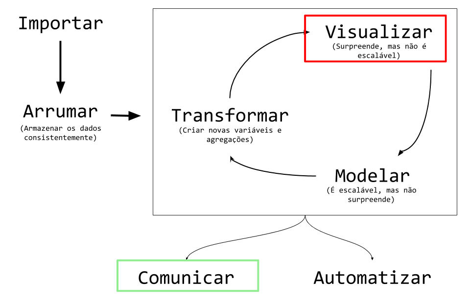
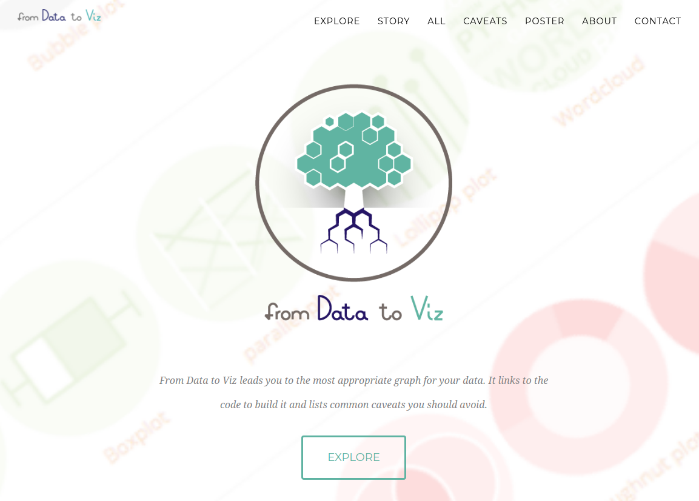
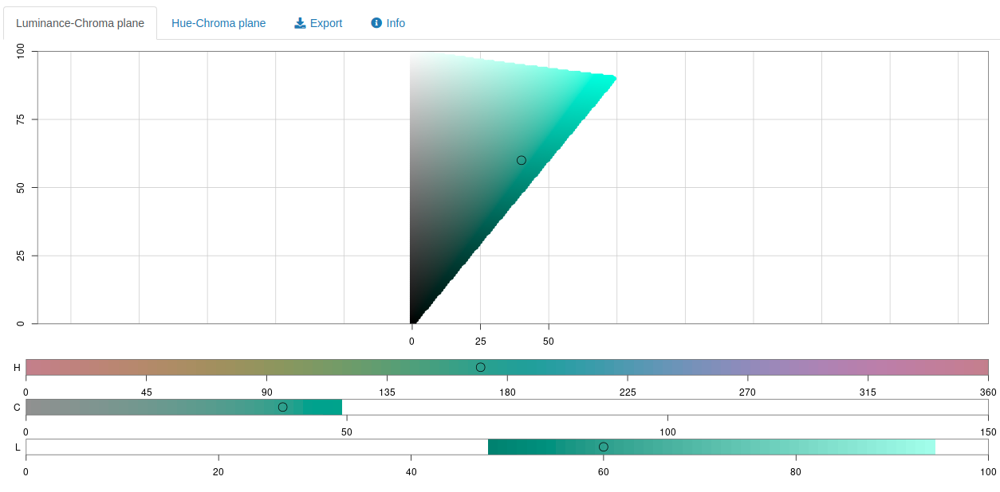
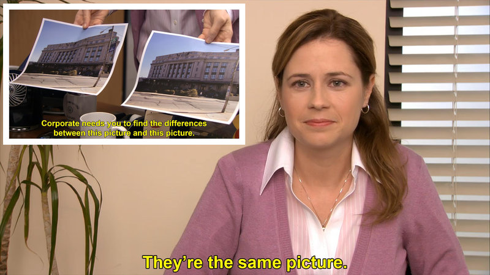

```{r setup, include=FALSE}
library(ggplot2)
library(dados)
options(htmltools.dir.version = FALSE)
link <- function(href, ...) {
  htmltools::a(
    href = href,
    target = "_blank",
    ...
  )
}
knitr::opts_chunk$set(
  echo = FALSE, 
  fig.align='center',
  warning=FALSE
)
xaringanExtra::use_panelset()
```

class: middle, center

# Sobre a Curso-R

---

## A empresa

<br>

```{r, echo = FALSE, out.width="50%", fig.align="center"}
knitr::include_graphics("https://d33wubrfki0l68.cloudfront.net/295643c6243701ae6a9bac3fb8ad467ff0ce3c84/d1785/img/logo/cursor1-41.png")
```

<br>
<br>

```{r, echo = FALSE, out.width="40%", fig.align="center"}
knitr::include_graphics("img/logo_r6.png")
```

---

## Filosofia de código aberto!

.pull-left[
```{r, echo = FALSE}
htmltools::h3("Livros")

link(
  href = "https://livro.curso-r.com/",
  htmltools::img(src = "img/hex-livro.png", width = "100px")
)

link(
  href = "https://curso-r.github.io/zen-do-r/index.html",
  htmltools::img(
    src = "img/zen-do-r.png",
    width = "100px",
    style = "margin-left: 20px;"
  )
)
```

<br>

```{r, echo = FALSE}
htmltools::h3("Lives")
link(
  href = "https://www.youtube.com/c/CursoR6",
  htmltools::img(src = "img/youtube.png", width = "200px")
)
```
]

.pull-right[
```{r, echo = FALSE}
htmltools::h3("Material dos cursos")
link(
  href = "https://github.com/curso-r",
  htmltools::img(src = "img/github.png", width = "230px")
)
```

<br>

```{r, echo = FALSE}
htmltools::h3("Blog")
link(
  href = "https://blog.curso-r.com/",
  htmltools::img(src = "img/blog.png", width = "400px")
)
```
]

<br>

.center[
### [www.curso-r.com](https://www.curso-r.com)
]


---
## Nossos cursos

```{r, echo = FALSE}
templatesR6::criar_slide_nossos_cursos()
```

---
class: middle, center

# Sobre o curso

---
## Dinâmica curso

- As aulas terão uma seção teórica, de exposição de conceitos, e prática, de aplicação de conceitos.

- O objetivo dos exercícios é gerar dúvidas. **Com exceção do trabalho final, nenhum exercício precisa ser entregue**.

- O certificado será emitido mediante uma **entrega final**, a ser detalhada a seguir. 

- Haverá monitoria para esclarecimento de dúvidas sempre 30 minutos antes do início das aulas.

- Usaremos os últimos minutos de cada aula para tirar dúvidas do conteúdo apresentado. Não haverá plantão de dúvidas pós aula.

- A gravação das aulas ficará disponível no Google Classroom por 1 ano após o final do curso.

---
## Dinâmica das aulas

- Mande dúvidas e comentários no chat em qualquer momento.

- Para falar, levante a mão.

- Algumas dúvidas serão respondidas na hora. Outras serão respondidas mais tarde na própria aula ou em aulas futuras.

---
## Trabalho final

Para o TCC do curso, entregará um TidyTuesday! 

```{r}
#| out.width: 60%
knitr::include_graphics("https://github.com/rfordatascience/tidytuesday/raw/master/static/tt_logo.png")
```


O TidyTuesday é um evento semanal criado para engajar a comunidade no uso do R para análise de dados. Se quiser conhecer mais, [siga a hashtag #tidytuesday no Twitter](https://twitter.com/hashtag/TidyTuesday)!

Mais informações [aqui](https://github.com/rfordatascience/tidytuesday/).

---
## Trabalho final

O resultado deverá ser entregue em um __arquivo zip__ contendo as visualizações e códigos. A submissão deve ser feita pelo classroom, subindo um arquivo .zip contendo

- Os __códigos em R__ utilizados para gerar os gráficos.
- Os __gráficos em imagens__ (.png, .jpeg, .gif etc)
- Um arquivo __README.md__ contando qual foi sua ideia e o processo de construção das visualizações.

__Observações__

- Não é necessário que a __base de dados__ esteja no repositório, já que ela pode ser lida diretamente da internet.
- __RMarkdown/Quarto__. Se você estiver confortável com relatórios reprodutíveis, pode entregar o trabalho em um relatório ou apresentação à sua escolha. Nesse caso, envie output final (em HTML, PDF, Word, etc) no lugar das imagens.
- __GitHub__. Se você estiver confortável com Git/GitHub, pode entregar o link do repositório no lugar do zip.

---
## Tire suas dúvidas

- **Não fique com dúvidas**.
 
- Fora do horário de aula ou monitoria:
    - envie suas perguntas gerais **sobre o curso** no Classroom.
     
    - envie preferencialmente suas perguntas **sobre R** no [nosso discourse](https://discourse.curso-r.com/).

- Saber fazer a pergunta certa vai te ajudar bastante nos estudos de programação. [Veja aqui dicas de como fazer uma boa pergunta](https://discourse.curso-r.com/t/como-escrever-uma-boa-pergunta/542).

---
class: middle, center, inverse

# Introdução

---
# Objetivos de aprendizagem

⬜ Compreender o papel da visualização em um projeto de ciência de dados.

--

⬜ Compreender as diferenças entre análise exploratória e análise descritiva.

--

⬜ Entender o funcionamento básico do pacote `{ggplot2}`.

--

⬜ Utilizar o `{ggplot2}` em um problema concreto.

--

Ficaremos com esses conteúdos por 2 aulas!

---

# O que é visualização de dados?

.pull-left[

- É a representação de dados em gráficos, tabelas e diagramas que podem ser interpretados por pessoas.

- É uma área interdisciplinar, misturando estatística, arte e comunicação.

- É uma parte da área de *data storytelling*, que envolve organizar todos os resultados de uma análise de dados em uma ordem lógica para comunicar de forma efetiva com a audiência.

]

.pull-right[

```{r}
knitr::include_graphics("https://raw.githubusercontent.com/allisonhorst/stats-illustrations/master/rstats-artwork/dog_treats_pipe.jpg")
```

Ilustração de [Allison Horst](https://www.allisonhorst.com)

]

---

# Por que fazer visualizações de dados?

.pull-left[

- Visualizações estão presentes na grande maioria dos projetos de ciência de dados.

- É a parte mais acessível da ciência de dados do ponto de vista de quem lê. Mostrar uma visualização costuma ser mais efetivo do que a saída de um modelo.

- É uma das partes mais difíceis de automatizar da ciência de dados. Uma carreira em *dataviz* dificilmente ficará obsoleta.

]

.pull-right[

```{r}
knitr::include_graphics("https://blog.curso-r.com/images/posts/conteudo/sf-miojo/mapa_muni_bonito_uf_cat.webp")
```

Imagem do [blog da Curso-R](https://blog.curso-r.com/posts/2019-02-10-sf-miojo/)

]

---

# Para que servem as visualizações?

.pull-left[

- Uma base de dados contém toda a informação que precisamos.

- No entanto, não somos capazes de tirar conclusões apenas olhando essas bases.

- Por isso, é necessário resumir esses dados em estatísticas.

- Nem sempre as estatísticas (os números) são úteis para uma comunicação efetiva... Por isso, faz sentido mostrá-las usando formas, cores e outros elementos que facilitam a absorção da informação pelas pessoas.

- Para o [Hadley Wickham](https://hadley.nz), visualizar dados serve para .blue[***surpreender***].

]

.pull-right[

```{r}
knitr::include_graphics("https://raw.githubusercontent.com/allisonhorst/stats-illustrations/master/rstats-artwork/presenting_monster.png")
```

Ilustração de [Allison Horst](https://www.allisonhorst.com)

]

---

# Gráficos bons e ruins

.pull-left[

### Gráficos para evitar

- Barras que não começam no zero
- [Gráficos de pizza](https://forum.abj.org.br/t/graficos-de-pizza-sao-ruins/41) (discutível!)
- ...

]

--

.pull-right[

### Gráficos para tomar cuidado

- Gráficos com dois eixos
- Gráficos pouco conhecidos
- ...

]

---
class: middle,inverse,center

# Ferramental

---

# Em que momentos utilizamos?

```{r, eval=FALSE}
img <- "img/ciclo-ciencia-de-dados.png" |> 
  magick::image_read() |> 
  magick::image_draw(xlim = c(0,1), ylim = c(0,1))
rect(.65, .8, .95, .95, border = "red", lty = 1, lwd = 5)
rect(.25, .15, .55, 0.05, border = "lightgreen", lty = 1, lwd = 5)
dev.off()
magick::image_write(img, "img/ciclo-ciencia-de-dados-vis.png")
```


```{r, echo=FALSE}

```

---

.pull-left[

## Análise exploratória

- É um trabalho de __investigação__ de dados
- A ferramenta: precisa ser __rápida__ de programar
- O objetivo é **aprender**

```{r, fig.width=6, fig.height=4}
ggplot2::ggplot(cars) +
  ggplot2::aes(speed, dist) +
  ggplot2::geom_point()
```


]

--

.pull-right[

## Análise descritiva

- É um trabalho de __otimização visual__
- A ferramenta: precisa ser __customizável__
- O objetivo é **comunicar**

```{r, fig.width=6, fig.height=4}
ggplot2::ggplot(cars) +
  ggplot2::aes(speed, dist) +
  ggplot2::geom_point(colour = "darkblue") +
  ggplot2::stat_smooth(
    se = FALSE, colour = "lightgray", method="loess",
    formula = "y~x"
  ) +
  ggplot2::theme_minimal(14) +
  ggplot2::labs(
    title = "A velocidade influencia na distância de parada?",
    subtitle = "Distância necessária para parar o carro",
    caption = "Fonte: Ezekiel, M. (1930) Methods of Correlation Analysis. Wiley",
    x = "Velocidade",
    y = "Distância para parar"
  )
```


]

--

.center[
### O `{ggplot2}` permite fazer as duas coisas!
]


---

# Gramática de gráficos *em camadas*

O pacote `{ggplot2}` segue duas filosofias que nos ajudam a entender o processo de construção dos gráficos:

1. Um gráfico estatístico é uma representação visual dos dados por meio de atributos estéticos (posição, cor, forma, tamanho, ...) de formas geométricas (pontos, linhas, barras, ...). [The Grammar of Graphics](https://www.springer.com/gp/book/9780387245447).

2. Um gráfico pode ser construído em camadas (um gráfico é a sobreposição de elementos visuais). [A layered grammar of graphics](https://vita.had.co.nz/papers/layered-grammar.html).

---

# Camadas

Para construir um gráfico, começamos com o *canvas*. A função `ggplot()` cria a primeira camada do nosso gráfico: uma tela em branco (cinza).

```{r dpi=300, out.width="50%"}
cars |> 
  ggplot()
```

---

# Camadas

.panelset[

.panel[
.panel-name[Canvas]

```{r canvas, dpi=300, out.width="40%"}
cars |> 
  ggplot()
```

]

.panel[
.panel-name[Canvas (R)]

```{r, canvas, echo=TRUE, dpi=300, out.width="40%"}
```

]

.panel[
.panel-name[Eixos]

```{r aes-mapping, dpi=300, out.width="40%"}
cars |> 
  ggplot() +
  aes(x = speed, y = dist)
```

]


.panel[
.panel-name[Eixos (R)]

```{r, aes-mapping, echo=TRUE, dpi=300, out.width="40%"}
```

]

.panel[
.panel-name[Geometria]

```{r dispersao, dpi=300, out.width="40%"}
cars |> 
  ggplot() +
  aes(x = speed, y = dist) +
  geom_point()
```

]

.panel[
.panel-name[Geometria (R)]

```{r, dispersao, echo=TRUE, dpi=300, out.width="40%"}
```

]
]

---

# Camadas

Depois, podemos trabalhar a estética com temas e detalhamentos.

.panelset[
.panel[
.panel-name[Completo]

```{r cars-completo, fig.width=9, fig.height=6, dpi=300}
ggplot(cars) +
  aes(speed, dist) +
  geom_point(colour = "darkblue") +
  stat_smooth(
    se = FALSE, colour = "lightgray", 
    method = "loess", formula = "y ~ x"
  ) +
  theme_minimal(14) +
  labs(
    title = "A velocidade influencia na distância de parada?",
    subtitle = "Distância necessária para parar o carro",
    caption = paste(
      "Fonte: Ezekiel, M. (1930) Methods of",
      "Correlation Analysis. Wiley"),
    x = "Velocidade", y = "Distância para parar"
  )
```

]
.panel[
.panel-name[Completo (R)]

```{r, cars-completo, fig.width=9, fig.height=6, echo=TRUE}
```

]
]

---

# Curiosidade: por que o `+`?

O `{ggplot2}`, diferentemente dos outros pacotes do `tidyverse`, não usa o *pipe* (`|>` ou `|>` depois do R 4.1). Isso acontece pois o `{ggplot2}` surgiu [antes que o autor tomasse conhecimento do pipe](https://www.reddit.com/r/dataisbeautiful/comments/3mp9r7/comment/cvi19ly/?utm_source=share&utm_medium=web2x&context=3).

<iframe id="reddit-embed" src="https://www.redditmedia.com/r/dataisbeautiful/comments/3mp9r7/im_hadley_wickham_chief_scientist_at_rstudio_and/cvi19ly/?depth=1&amp;showmore=false&amp;embed=true&amp;showmedia=false" sandbox="allow-scripts allow-same-origin allow-popups" style="border: none;" height="437" width="640" scrolling="no"></iframe>

---

# [Dúvidas?](https://www.rstudio.com/resources/cheatsheets/)

```{r, out.width="75%"}
knitr::include_graphics("https://raw.githubusercontent.com/rstudio/cheatsheets/main/pngs/data-visualization.png")
```

---

# [Qual gráfico escolher?](https://www.data-to-viz.com)

```{r, out.width="90%"}

```

---

# Base de dados do exemplo

Para os slides a seguir, vamos usar a base do imdb. Atenção para a coluna lucro, que criamos fazendo a diferença entre receita e orçamento.

```{r}
#| echo: true
#| eval: false
library(tidyverse)
imdb <- read_rds("dados/imdb.rds")
imdb <- imdb |> mutate(lucro = receita - orcamento)
```


```{r, include=FALSE}
library(tidyverse)
imdb <- read_rds("../dados/imdb.rds")
imdb <- imdb |> mutate(lucro = receita - orcamento)
options(width = 80)
knitr::opts_chunk$set(
  fig.width = 5,
  fig.height = 4,
  fig.align = "center",
  fig.retina = 2
)
```

---
# Um gráfico de pontos (dispersão)

Podemos fazer um gráfico de dispersão da receita contra o orçamento dos filmes acrescentando a função `geom_point()` ao código anterior.

.tiny[
```{r ggdispersao, echo=TRUE}
imdb |> 
  ggplot() +
  geom_point(aes(x = orcamento, y = receita))
```
]

---
<br><br>

Muitos pontos para discutir:

- Esse gráfico tem duas camadas: o canvas, gerado pela função `ggplot()`, e os pontos, gerado pela função `geom_point()`.

- Unimos as camadas de um ggplot usando um `+`. Sim, precisamos controlar a nossa vontade de colocar um ` |> ` em vez de `+`, e essa é uma fonte de erro bem comum. O motivo para precisarmos usar `+` em vez do `|>` é o pacote ggplot ter nascido primeiro que o pipe.

- A função `geom_point()` define que a forma geométrica (daí o prefixo `geom`) utilizada para representar os dados será pontos. Existe uma família de funções `geom`, sendo que cada uma vai representar uma forma geométrica diferente.

- O primeiro argumento de qualquer função `geom` é o `mapping`. Esse argumento serve para mapear os dados nos atributos estéticos da forma geométrica escolhida. Ele sempre receberá a função `aes()`. No código, nós omitimos o nome do argumento, mas poderíamos ter escrito `geom_point(mapping = aes(x = orcamento, y = receita))`.

---
<br><br>

- A função `aes()` serve para *mapear os dados aos elementos estéticos do gráfico*. Os argumentos dela vão sempre depender da forma geométrica que estamos utilizando. No caso de um gráfico de pontos, precisamos definir como as posições do eixo x e y serão construídas. No exemplo, a posição do ponto no eixo x será dada pela coluna `orcamento` e a posição do ponto no eixo y será dada pela coluna `receita`.

- O *warning* indica quantas observações (linhas) precisaram ser removidas, por não possuir informação de orçamento ou receita.

- Veremos nos próximos exemplos que será muito comum manipularmos a base (aplicarmos diversas funções do `dplyr`, por exemplo) antes de chamarmos a função `ggplot`. 

**O mapeamento das COLUNAS nas FORMAS GEOMÉTRICAS deve ser SEMPRE feito dentro da função `aes()`**.

---
<br><br>

Vamos agora inserir um novo elemento visual ao gráfico: a reta x = y.

.tiny[
```{r ggreta, echo=TRUE}
imdb |>
  ggplot() +
  geom_point(aes(x = orcamento, y = receita)) +
  geom_abline(intercept = 0, slope = 1, color = "red")
```
]

---
<br><br>

- A reta x = y é acrescentada ao gráfico pela função `geom_abline()`. Esse `geom` pode ser utilizado para desenhar qualquer reta do tipo `y = a + b * x`, sendo `a` o intercepto (*intercept*) da reta e `b` o seu coeficiente angular (*slope*).

- Essa reta nos permite observar o número de filmes que obtiveram lucro (pontos acima da reta) e aqueles que obtiveram prejuízo (pontos abaixo da reta).

- Como não estamos mapeando colunas a essa reta, não precisamos colocar os argumentos da função `geom_abline()` do `aes()`.

---
<br><br>

Veja como o ggplot realmente é construído por camadas. Agora, colocamos a camada da reta antes da camada dos pontos. Os pontos ficam em cima da reta.

.tiny[
```{r ggretavermelha, echo=TRUE}
imdb |>
  ggplot() +
  geom_abline(intercept = 0, slope = 1, color = "red") +
  geom_point(aes(x = orcamento, y = receita))
```
]

---
<br><br>

Os atributos `x` e `y` são necessários para construirmos um gráfico de pontos. Outros atributos também podem ser mapeados em pontos, como a cor. Como a coluna `lucro` é numérica, um degradê de cores é criado para os pontos, a depender do lucro.

.tiny[
```{r ggdispersaoazul, echo=TRUE}
imdb |>
  ggplot() +
  geom_point(aes(x = orcamento, y = receita, color = lucro))
```
]

---
<br><br>

Poderíamos também classificar os filmes entre aqueles que lucraram ou não. Uma cor é atribuída a cada categoria.

.tiny[
```{r gglucro, echo=TRUE}
imdb |>
  mutate(
    lucrou = ifelse(lucro <= 0, "Não", "Sim")
  ) |>
  ggplot() +
  geom_point(aes(x = orcamento, y = receita, color = lucrou))
```
]

---
# Gráfico de linhas

Utilizamos o `geom_line` para fazer gráficos de linhas. Gráficos de linha são muito utilizados para representar *séries temporais*, isto é, observações medidas repetidamente em intervalos (em geral) equidistantes de tempo.

Assim como nos gráficos de pontos, precisamos definir as posições `x` e `y` para construirmos gráficos de linhas.

A seguir, construímos o gráfico das notas médias dos filmes produzidos em cada ano, 

---
<br><br>

.tiny[
```{r gglinha, fig.width = 8, fig.height = 4, echo=TRUE}
imdb |> 
  group_by(ano) |> 
  summarise(nota_media = mean(nota_imdb, na.rm = TRUE)) |> 
  ggplot() +
  geom_line(aes(x = ano, y = nota_media))
```
]

---
<br><br>

Se mapearmos uma coluna à cor das retas, serão construídas uma reta correspondente a cada categoria distinta dessa coluna.

.tiny[
```{r gglinhacolorida, fig.width = 8, fig.height = 3, echo=TRUE}
imdb |> 
  filter(!is.na(idioma)) |> 
  mutate(idioma_ingles = case_when(idioma == "English" ~ "Apenas Inglês",
                                   str_detect(idioma, "English") ~ "Inglês e outros idiomas",
                                   TRUE ~ "Outros idiomas")) |>
  group_by(ano, idioma_ingles) |> 
  summarise(num_filmes = n(), .groups = "drop") |> 
  ggplot() +
  geom_line(aes(x = ano, y = num_filmes, color = idioma_ingles))
```
]

---
<br><br>

Podemos colocar pontos e retas no mesmo gráfico. Basta acrescentar os dois `geoms`. O gráfico abaixo mostra nota média anual dos filmes do Robert De Niro.

```{r ggdeniro, fig.width = 8, fig.height = 3, echo=TRUE}
imdb |> 
  filter(str_detect(elenco, "Robert De Niro")) |> 
  group_by(ano) |> 
  summarise(nota_media = mean(nota_imdb, na.rm = TRUE)) |> 
  ggplot() +
  geom_line(aes(x = ano, y = nota_media)) +
  geom_point(aes(x = ano, y = nota_media))
```

---
<br><br>

Quando precisamos usar o mesmo `aes()` em vários `geoms`, podemos defini-lo dentro da função `ggplot()`. Esse `aes()` será então distribuído para todo `geom` do gráfico. O código anterior pode ser reescrito da seguinte forma.

```{r gglinhaponto, fig.width = 8, fig.height = 3, echo=TRUE}
imdb |> 
  filter(str_detect(elenco, "Robert De Niro")) |> 
  group_by(ano) |> 
  summarise(nota_media = mean(nota_imdb, na.rm = TRUE)) |> 
  ggplot(aes(x = ano, y = nota_media)) +
  geom_line() +
  geom_point()
```

---
<br><br>

Se algum `geom` necessitar de um atributo que os outros não precisam, esse atributo pode ser especificado normalmente dentro dele. Abaixo, utilizamos o `geom_label` para colocar as notas médias no gráfico. Além do `x` e `y`, o `geom_label` também precisa do texto que será escrito no gráfico.

.tiny[
```{r gglinhalabel, fig.width = 8, fig.height = 3, echo=TRUE}
imdb |> 
  filter(str_detect(elenco, "Robert De Niro")) |> 
  group_by(ano) |> 
  summarise(nota_media = mean(nota_imdb, na.rm = TRUE)) |> 
  mutate(nota_media = round(nota_media, 1)) |> 
  ggplot(aes(x = ano, y = nota_media)) +
  geom_line() +
  geom_label(aes(label = nota_media))
```
]

---
# Gráfico de barras

Para construir gráficos de barras, utilizamos o `geom_col`. A seguir, construímos um gráfico de barras do número de filmes das 10 pessoas que mais dirigiram filmes na nossa base do IMDB.

.tiny[
```{r ggbarras, fig.width = 7, fig.height = 3.5, echo=TRUE}
imdb |> 
  count(direcao) |>
  slice_max(order_by = n, n = 10) |> 
  ggplot() +
  geom_col(aes(x = direcao, y = n))
```
]
---
<br><br>

Gráficos de barras também precisam dos atributos `x` e `y`, sendo que o atributo `y` representará a altura de cada barra.

No gráfico anterior, vemos que o `NA` é considerado uma "opção" de direcao e entra no gráfico. Podemos retirar os `NAs` dessa coluna previamente utilizando a função `filter()`.

A seguir, além de retirar os `NAs`, atribuímos a coluna `direcao` à cor das colunas. Repare que, nesse caso, não utilizamos o atributo `color` e sim `fill`. A regra é a seguinte: o atributo `color` colore objetos sem área (pontos, linhas, contornos), o atributo `fill` preenche objetos com cor (barras, áreas, polígonos em geral).

---
<br><br>

.tiny[
```{r ggbarracolorida, fig.width = 7, fig.height = 3.5, echo=TRUE}
imdb |> 
  count(direcao) |>
  filter(!is.na(direcao)) |> 
  slice_max(order_by = n, n = 10) |> 
  ggplot() +
  geom_col(
    aes(x = direcao, y = n, fill = direcao), show.legend = FALSE
  )
```
]

---
<br><br>

Para consertar as labels do eixo `x`, uma alternativa é inverter os eixos do gráfico, construindo barras horizontais.

.tiny[
```{r ggbarracoordflip, fig.width = 7, fig.height = 3.5, echo=TRUE}
imdb |> 
  count(direcao) |>
  filter(!is.na(direcao)) |> 
  slice_max(order_by = n, n = 10) |> 
  ggplot() +
  geom_col(
    aes(x = direcao, y = n, fill = direcao), show.legend = FALSE
  ) +
  coord_flip()
```
]

---
<br><br>

Para ordenar as colunas, precisamos mudar a ordem dos níveis do *fator* `direcao`. Para isso, utilizamos a função `fct_reorder()` do pacote `forcats`. A nova ordem será estabelecida pela coluna `n` (quantidade de filmes).

Fatores dentro do R são números inteiros (1, 2, 3, ...) que possuem uma representação textual. Variáveis categóricas são transformadas em fatores pelo ggplot pois todo eixo cartesiano é numérico. Assim, os textos de uma variável categórica são, internamente, números inteiros.

Por padrão, os inteiros são atribuídos a cada categoria de uma variável pela ordem alfabética (repare na ordem das pessoas que dirigiram filmes nos gráficos anteriores). Assim, se transformássemos o vetor `c("banana", "uva", "melancia")` em um fator, a atribuição de inteiros seria: "banana" vira 1, "melancia" vira 2 e "uva" vira 3. Embora sejam inteiros internamente, sempre que chamássemos esse novo vetor, ainda sim veríamos os textos "banana", "uva" e "melancia".

---
<br><br>

.tiny[
```{r ggbarraforcats, fig.width = 7, fig.height = 3.5, echo=TRUE}
imdb |> 
  count(direcao) |>
  filter(!is.na(direcao)) |> 
  slice_max(order_by = n, n = 10) |> 
  mutate(direcao = forcats::fct_reorder(direcao, n)) |> 
  ggplot() +
  geom_col(
    aes(x = direcao, y = n, fill = direcao),
    show.legend = FALSE
  ) +
  coord_flip()
```
]

---
<br><br>

Por fim, podemos colocar uma label com o número de filmes de cada pessoa que dirigiu filmes dentro de cada barra.

.tiny[
```{r ggbarralabel, fig.width = 7, fig.height = 3.5, echo=TRUE}
imdb |> 
  count(direcao) |>
  filter(!is.na(direcao)) |> 
  slice_max(order_by = n, n = 10) |> 
  mutate(direcao = forcats::fct_reorder(direcao, n)) |> 
  ggplot() +
  geom_col(aes(x = direcao, y = n, fill = direcao), show.legend = FALSE) +
  geom_label(aes(x = direcao, y = n/2, label = n)) +
  coord_flip()
```
]

---
# Histograma

Para construir histogramas, usamos o `geom_histogram`. Esse `geom` só precisa do atributo `x` (o eixo y é construído automaticamente). Histogramas são úteis para avaliarmos a distribuição de uma variável.

A seguir, construímos o histograma do lucro dos filmes do diretor Steven Spielberg.
O primeiro *warning* nos diz que o eixo x foi dividido em 30 intervalos para a construção do histograma.

---
<br><br>

```{r gghist, fig.width = 7, fig.height = 3.5, echo=TRUE}
imdb |> 
  filter(direcao == "Steven Spielberg") |>
  ggplot() +
  geom_histogram(aes(x = lucro))
```

---
<br><br>

Para definir o tamanho de cada intervalo, podemos utilizar o argumento `bindwidth`.

.tiny[
```{r gghistbind, fig.width = 7, fig.height = 3.5, echo=TRUE}
imdb |> 
  filter(direcao == "Steven Spielberg") |>
  ggplot() +
  geom_histogram(
    aes(x = lucro), 
    binwidth = 100000000,
    color = "white"
  )
```
]

---
# Boxplot

Boxplots também são úteis para estudarmos a distribuição de uma variável, principalmente quando queremos comparar várias distribuições. 

Para construir um boxplot no ggplot, utilizamos a função `geom_boxplot`. Ele precisa dos atributos `x` e `y`, sendo que ao atributo `x` devemos mapear uma variável categórica.

A seguir, construímos boxplots do lucro dos filmes das pessoas que dirigiram de 15 filmes.

---
<br><br>

.tiny[
```{r ggboxplot, fig.width = 7, fig.height = 3.5, echo=TRUE}
direcao_mais_15_filmes <- imdb |> 
  filter(!is.na(direcao), !is.na(lucro) ) |>
  group_by(direcao) |> 
  count(direcao, sort = TRUE) |> 
  filter(n >= 15)
imdb |> 
  filter(direcao %in% direcao_mais_15_filmes$direcao) |> 
  ggplot() +
  geom_boxplot(aes(x = direcao, y = lucro)) +
  coord_flip()
```
]

---
<br><br>

Também podemos reordenar a ordem dos boxplots utilizando a função `forcats::fct_reorder`.

.tiny[
```{r ggboxplotreorder, fig.width = 7, fig.height = 3.5, echo=TRUE}
imdb |> 
  filter(direcao %in% direcao_mais_15_filmes$direcao) |> 
  mutate(direcao = forcats::fct_reorder(direcao, lucro, .na_rm = TRUE)) |> 
  ggplot() +
  geom_boxplot(aes(x = direcao, y = lucro)) +
  coord_flip()
```
]

---
# Títulos, labels e escalas

Para colocar títulos no gráfico ou trocar as labels dos atributos, utilizamos a função `labs()`. 

Para mudar as escalas (textos e quebras), utilizamos as funções da família `scale_`.

Podemos usar a função `coord_cartesian()` para definir qual porção do gráfico deve ser mostrada.

---
<br><br>

Colocando título, subtítulo e mudando as labels.

.tiny[
```{r gglabs, fig.width = 7, fig.height = 3, echo=TRUE}
imdb |>
  ggplot() +
  geom_point(mapping = aes(x = orcamento, y = receita, color = lucro)) +
  labs(
    x = "Orçamento ($)", y = "Receita ($)", color = "Lucro ($)",
    title = "Gráfico de dispersão", subtitle = "Receita vs Orçamento"
  )
```
]

---
<br><br>

Mudando as quebras dos eixos `x` e `y`.

.tiny[
```{r ggscale, fig.width = 7, fig.height = 3, echo=TRUE}
imdb |> 
  group_by(ano) |> 
  summarise(nota_media = mean(nota_imdb, na.rm = TRUE)) |> 
  ggplot() +
  geom_line(aes(x = ano, y = nota_media)) +
  scale_x_continuous(breaks = seq(1916, 2016, 10)) +
  scale_y_continuous(breaks = seq(0, 10, 2))
```
]

---
<br><br>

Mudando a escala do gráfico.

.tiny[
```{r ggcoordcartesian, fig.width = 7, fig.height = 3, echo=TRUE}
imdb |> 
  group_by(ano) |> 
  summarise(nota_media = mean(nota_imdb, na.rm = TRUE)) |> 
  ggplot() +
  geom_line(aes(x = ano, y = nota_media)) +
  scale_x_continuous(breaks = seq(1916, 2016, 10)) +
  scale_y_continuous(breaks = seq(0, 10, 2)) +
  coord_cartesian(ylim = c(0, 10))
```
]

---
# Cores

Também existe funções `scale` para os atributos de cor: `scale_color_` e `scale_fill_`. 

Para escolher manualmente as cores de um gráfico, utilize as funções 
`scale_color_manual` e `scale_fill_manual()`.

Para trocar o nome nas legendas geradas por atributos de cor, utilize as funções `scale_color_discrete` e `scale_fill_discrete`.

---
<br><br>

Substituindo as cores padrão do gráfico por um outro conjunto de cores.

.tiny[
```{r ggfillmanual, fig.width = 7, fig.height = 3, echo=TRUE}
imdb |> 
  count(direcao) |>
  filter(!is.na(direcao)) |> 
  slice_max(order_by = n, n = 5) |> 
  ggplot() +
  geom_col(aes(x = direcao, y = n, fill = direcao), show.legend = FALSE) +
  coord_flip() +
  scale_fill_manual(values = c("red", "blue", "green", "pink", "purple"))
```
]

---
<br><br>

Também podemos usar códigos hexadecimais.

.tiny[
```{r ggfillhex, fig.width = 7, fig.height = 3, echo=TRUE}
imdb |> 
  count(direcao) |>
  filter(!is.na(direcao)) |> 
  slice_max(order_by = n, n = 5) |> 
  ggplot() +
  geom_col(aes(x = direcao, y = n, fill = direcao), show.legend = FALSE) +
  coord_flip() +
  scale_fill_manual(
    values = c("#ff4500", "#268b07", "#ff7400", "#0befff", "#a4bdba")
  )
```
]

---
<br><br>

Trocando os textos da legenda.

.tiny[
```{r gglabelslegenda, fig.width = 7, fig.height = 3, echo=TRUE}
imdb |> 
  mutate(sucesso_nota = case_when(nota_imdb >= 7 ~ "sucesso_nota_imbd",
                                  TRUE ~ "sem_sucesso_nota_imdb")) |>
  group_by(ano, sucesso_nota) |> 
  summarise(num_filmes = n(), .groups = "drop") |> 
  ggplot() +
  geom_line(aes(x = ano, y = num_filmes, color = sucesso_nota)) +
  scale_color_discrete(labels = c("Nota menor que 7", "Nota maior ou igual à 7"))
```
]

---
# Temas

Os gráficos que vimos até agora usam o tema padrão do ggplot2. Existem outros temas prontos para utilizarmos presentes na família de funções `theme_`.

Você também pode criar o seu próprio tema utilizando a função `theme()`. Nesse caso, para trocar os elementos estéticos do gráfico precisamos usar as funções `element_text()` para textos, `element_line()` para linhas, `element_rect()` para áreas e `element_blank()` para remover elementos.

---
<br><br>

```{r ggthememinimal, echo=TRUE}
imdb |> 
  ggplot() +
  geom_point(mapping = aes(x = orcamento, y = receita)) +
  theme_minimal() 
```

---
<br><br>

```{r ggthemebw, echo=TRUE}
imdb |> 
  ggplot() +
  geom_point(mapping = aes(x = orcamento, y = receita)) +
  theme_bw()
```

---
<br><br>

```{r ggthemeclassic, echo=TRUE}
imdb |> 
  ggplot() +
  geom_point(mapping = aes(x = orcamento, y = receita)) +
  theme_classic()
```

---
<br><br>

```{r ggthemedark}
imdb |> 
  ggplot() +
  geom_point(mapping = aes(x = orcamento, y = receita)) +
  theme_dark()
```

---
<br><br>

Criando um próprio tema.

.tiny[

```{r ggthemealterado, fig.width = 7, fig.height = 3, echo=TRUE}
imdb |> 
  ggplot() +
  geom_point(mapping = aes(x = orcamento, y = receita), color = "white") +
  labs(title = "Gráfico de dispersão", subtitle = "Receita vs Orçamento") +
  theme(
    plot.title = element_text(hjust = 0.5),
    plot.subtitle = element_text(hjust = 0.5),
    axis.title = element_text(color = "purple"),
    panel.background = element_rect(fill = "black"),
    panel.grid = element_blank()
  )
```

]

---

# Vamos ao R!

```{r}
knitr::include_graphics("img/cat.gif")
```


---
class: middle, center, inverse

# Otimização Visual

---
# Objetivos de aprendizagem

⬜ Discutir os principais aspectos visuais a serem considerados em um gráfico estatístico

--

⬜ Compreender como modificar um `ggplot` para comunicar resultados de maneira eficiente.

--

⬜ Otimizar um gráfico que utilizamos na aula anterior.

---

# O que é otimização visual?

- É o ato de trabalhar em uma visualização aprimorar a comunicação.

- Pode envolver alterações nas cores, fontes, elementos geométricos, entre outros, a partir de um gráfico exploratório.

- Não é uma ciência exata, mas recolhe elementos da ciência para aumentar a probabilidade de sucesso da visualização.

---

# Recursos pré-atentativos

- Uma propriedade visual pré-atentativa é processada pelo nosso [cérebro antes de uma ação consciente](https://www.interaction-design.org/literature/article/preattentive-visual-properties-and-how-to-use-them-in-information-visualization).

- Como isso esse processamento é muito rápido, trata-se de uma oportunidade para tornar visualizações mais amigáveis e diretamente interpretadas.

- Segundo [Colin Ware](https://en.wikipedia.org/wiki/Colin_Ware), existem 4 propriedades pré-atentativas que podemos explorar:
    - Cor
    - Forma
    - Movimento
    - Posicionamento
    
- O objetivo dos recursos pré-atentativos é __<span style="color:blue;">chamar a atenção</span>__.

---

# Recursos pré-atentativos

- Uma propriedade visual pré-atentativa é processada pelo nosso [cérebro antes de uma ação consciente](https://www.interaction-design.org/literature/article/preattentive-visual-properties-and-how-to-use-them-in-information-visualization).

- Como isso esse processamento é muito rápido, trata-se de uma oportunidade para tornar visualizações mais amigáveis e diretamente interpretadas.

- Segundo [Colin Ware](https://en.wikipedia.org/wiki/Colin_Ware), existem 4 propriedades pré-atentativas que podemos explorar:
    - __Cor__
    - __Forma__
    - Movimento
    - Posicionamento
    
- O objetivo dos recursos pré-atentativos é __<span style="color:blue;">chamar a atenção</span>__.

---
class: inverse, middle

##### E por último isso

<br/><br/>

# Primeiro você lerá isso

<br/><br/>

### Depois você lerá isso

<br/><br/>

#### Então isso

---
class: middle, center

# Cor

---

# Cores do zero: HCL vs RGB

- HCL (hue, chroma, luminance) é vantajoso pois é mais intuitivo de criar do que RGB, já que o HCL tem apenas um eixo de cores (*hue*), enquanto RGB é uma composição de três (*red*, *green*, *blue*)

- O pacote `{colorspace}` permite usar HCL para definir uma cor/paleta: experimente `colorspace::hcl_color_picker()`

- [Nesse site](https://color.adobe.com/create/color-wheel), também é possível criar algumas paletas

```{r, out.width="70%"}

```

---

# Paletas de cores prontas

- __Escalas qualitativas__: utilizado para variáveis nominais (sexo, cor/raça)

- __Escalas divergentes__: utilizado para variáveis que têm um centro neutro (favorável/neutro/desfavorável, correlação)

- __Escalas sequenciais__: utilizado para variáveis ordinais (faixa etária, renda)

- __Viridis__: útil para comunicar com pessoas com daltonismo

---

# Paletas de cores no {ggplot2}

- `scale_*_brewer()`: utilizada para variáveis discretas. Possui três tipos: divergente, qualitativa e sequencial.

- `scale_*_distiller()`: utilizada para variáveis contínuas. Interpola as cores do *brewer* para lidar com todos os valores.

- `scale_*_fermenter()`: utilizada para variáveis contínuas, que são transformadas em discretas (binned).

- `scale_*_viridis_[cdb]`: Escala viridis para variáveis `c`ontínuas, `d`iscretas ou `b`inned.

- `scale_*_manual()`: inclui um conjunto de cores manualmente.

---

# Paletas de outros pacotes

- [`{ggthemr}`](https://github.com/Mikata-Project/ggthemr) tem um monte de paletas, mas está um pouco desatualizado.

- [`{hrbrthemes}`](https://github.com/hrbrmstr/hrbrthemes) contém uma lista de temas escolhidos pelo Bob Rudis.

- [`{ghibli}`](https://ewenme.github.io/ghibli/) tem paletas de cores relacionadas ao Studio Ghibli

- [`{paletteer}`](https://github.com/EmilHvitfeldt/paletteer) tem uma coleção de cores de vários outros pacotes de paletas.

---

# Qual visualização é melhor?

.pull-left[

```{r, fig.width=5, fig.height=4, dpi = 300}
notas_pixar <- dados::pixar_avalicao_publico |> 
  dplyr::count(nota_cinema_score) |> 
  dplyr::mutate(
    nota = forcats::fct_na_value_to_level(nota_cinema_score, "(vazio)"),
    nota = forcats::fct_relevel(nota, c("A-", "A", "A+", "(vazio)"))
  )
notas_pixar |> 
  ggplot2::ggplot() +
  ggplot2::aes(nota, n) +
  ggplot2::geom_col(width = .5) +
  ggplot2::scale_y_continuous(limits = c(0, 15)) +
  ggplot2::labs(title = "A maioria dos filmes da pixar tem nota 'A'") +
  ggplot2::theme_minimal(12)
```

]


.pull-right[

```{r, fig.width=5, fig.height=4, dpi = 300}
notas_pixar |> 
  dplyr::mutate(cor = dplyr::case_when(
    nota == "A" ~ "b",
    TRUE ~ "a"
  )) |> 
  ggplot2::ggplot() +
  ggplot2::aes(nota, n, fill = cor) +
  ggplot2::geom_col(width = .5, show.legend = FALSE) +
  ggplot2::scale_y_continuous(limits = c(0, 15)) +
  ggplot2::scale_fill_manual(values = c("gray30", "tomato")) +
  ggplot2::labs(title = "A maioria dos filmes da pixar tem nota 'A'") +
  ggplot2::theme_minimal(12)
```

]

---

# É subjetivo...

```{r}

```


---
class: middle, center

# Forma

---

# Formas

- Geralmente queremos contrastar formas para chamar a atenção...

--

- Sem com isso fazer uma bagunça visual.

--

- A ideia é utilizar apenas um elemento, como tamanho, forma, largura, marcações, angulações, etc. para mostrar o contraste.


---

# Exemplos


```{r warning=FALSE, fig.width=9, fig.height=6, dpi=300}
p_size <- notas_pixar |> 
  dplyr::mutate(tipo = dplyr::case_when(
    nota == "A" ~ "b",
    TRUE ~ "a"
  )) |> 
  ggplot2::ggplot() +
  ggplot2::aes(nota, n, size = tipo) +
  ggplot2::geom_segment(ggplot2::aes(xend = nota, yend = 0), size = .5) +
  ggplot2::geom_point() +
  ggplot2::scale_y_continuous(limits = c(0, 15)) +
  ggplot2::scale_size_discrete(range = c(3, 6)) +
  ggplot2::theme_minimal(12) +
  ggplot2::theme(legend.position = "none")


p_shape <- notas_pixar |> 
  dplyr::mutate(tipo = dplyr::case_when(
    nota == "A" ~ "b",
    TRUE ~ "a"
  )) |> 
  ggplot2::ggplot() +
  ggplot2::aes(nota, n, shape = tipo) +
  ggplot2::geom_segment(ggplot2::aes(xend = nota, yend = 0), size = .5) +
  ggplot2::geom_point(size = 6) +
  ggplot2::scale_shape_manual(values = c(1, 16)) +
  ggplot2::scale_y_continuous(limits = c(0, 15)) +
  ggplot2::theme_minimal(12) +
  ggplot2::theme(legend.position = "none")

p_mark <- notas_pixar |> 
  dplyr::mutate(tipo = dplyr::case_when(
    nota == "A" ~ "b",
    TRUE ~ "a"
  )) |> 
  ggplot2::ggplot() +
  ggplot2::aes(nota, n, shape = tipo) +
  ggplot2::geom_segment(ggplot2::aes(xend = nota, yend = 0), size = .5) +
  ggplot2::geom_point(size = 6) +
  ggplot2::scale_shape_manual(values = c(1, 13)) +
  ggplot2::scale_y_continuous(limits = c(0, 15)) +
  ggplot2::theme_minimal(12) +
  ggplot2::theme(legend.position = "none")

p_bar <- notas_pixar |> 
  dplyr::mutate(tipo = dplyr::case_when(
    nota == "A" ~ "b",
    TRUE ~ "a"
  )) |> 
  ggplot2::ggplot() +
  ggplot2::aes(nota, n) +
  ggplot2::geom_col(width = c(.8, .5,.5,.5)) +
  ggplot2::scale_y_continuous(limits = c(0, 15)) +
  ggplot2::theme_minimal(12)

patchwork::wrap_plots(p_size, p_shape, p_mark, p_bar)

```

---

# Princípios Gestalt

- __Gestalt__ é uma área ampla da psicologia que não vamos aprofundar.

- Está ligada à ideia de que, em uma visualização, o todo é maior do que a soma das partes.

- Dois princípios Gestalt aplicáveis em visualização de dados são a nossa capacidade de:
    - Completar figuras
    - Agrupar objetos

- Ou seja, podemos criar visualizações que ativam essas capacidades.

---

# Qual visualização é melhor?

.pull-left[


```{r, fig.height=4, fig.width=6, dpi = 300}
dados::pinguins |> 
  tidyr::drop_na() |> 
  ggplot2::ggplot() +
  ggplot2::aes(
    x = comprimento_bico, 
    y = profundidade_bico, 
    shape = especie
  ) +
  ggplot2::geom_point() +
  ggplot2::theme_minimal(12) +
  ggplot2::labs() +
  ggplot2::theme(legend.position = "bottom")

```

]

.pull-right[


```{r, fig.height=4, fig.width=6, dpi = 300}
dados::pinguins |> 
  tidyr::drop_na() |> 
  ggplot2::ggplot(ggplot2::aes(
    x = comprimento_bico, 
    y = profundidade_bico, 
    shape = especie,
    group = especie
  )) +
  ggplot2::geom_point() +
  ggplot2::theme_minimal(12) +
  ggplot2::theme(legend.position = "bottom") +
  ggplot2::stat_ellipse(
    type = "norm", 
    geom = "polygon",
    alpha = .05,
    level = .95,
    colour = "transparent"
  )
```

]

---

# Vamos ao R!

```{r}
knitr::include_graphics("img/cat.gif")
```

---
class: inverse, middle, center

# Extensões do ggplot2

---

# Objetivos de aprendizagem

⬜ Conhecer extensões do `{ggplot2}`

⬜ Experimentar extensões separadamente

⬜ Estudar um exemplo juntando várias extensões.

---

# O que é uma extensão?

- O `{ggplot2}` é maravilhoso, mas não possui todos os gráficos possíveis.

- Por isso, pessoas do mundo todo desenvolvem extensões para a comunidade usar, que vão desde pacotes com novos temas/cores, geometrias eixos até a [possibilidade de desenhar gatinhos em barras](https://coolbutuseless.github.io/package/ggpattern/index.html)

- A equipe do tidyverse mantém uma [lista curada de extensões do `{ggplot2}`](https://exts.ggplot2.tidyverse.org/gallery/)

---

# Como criar uma extensão?

- A [edição mais recente](https://ggplot2-book.org/extensions.html) do livro do `{ggplot2}` possui um tutorial de como criar extensões para o pacote.

- ⚠️  Cuidado! Criar extensões do `{ggplot2}` não é fácil. Trata-se de um pacote complexo, exigindo bastante conhecimento de elementos internos do R.

- Uma forma legal de estudar extensões é olhando o código de pacotes. Recomendamos as extensões do [Thomas Lin Pedersen](https://github.com/thomasp85), já que ele é o mantenedor atual do `{ggplot2}` e, portanto, conhece muito bem as melhores práticas para criar extensões.

---

# Vamos ao R!

```{r}
knitr::include_graphics("img/cat.gif")
```

---
class: inverse, middle, center

# Interatividade

---

# Objetivos de aprendizagem

⬜ Conhecer a diferença entre visualizações estáticas e dinâmicas

⬜ Experimentar algumas visualizações

⬜ Cobrir temas que não foram abordados no curso e encerrar.

---

## Gráficos interativos e estáticos

- Gráficos interativos têm o poder de engajar mais, por conta do efeito *voosh*. Todo ser humano gosta de interagir com aquilo que está analisando.

- No entanto, isso vem com um custo: não são todos os documentos capazes de processar visualizações dinâmicas. Em particular, PDF, Word e PPT não rodam esses conteúdos.

- Vamos visitar tanto o mundo estático quanto dinâmico, para que você saiba por onde começar quando receber um novo desafio.


---

## htmlwidgets

`htmlwidgets` são bibliotecas de visualização JavaScript encapsuladas em pacotes de R. Elas nos permitem usar diversas ferramentas JavaScript diretamente do R, adicionando algumas poucas linhas de código em nosso script.

Usando `htmlwidgets`, conseguimos construir tabelas, gráficos, mapas e muito outras visualizações interativas e naturalmente bonitas.

[Clique aqui](https://www.htmlwidgets.org/index.html) para acessar uma lista completa de todos os `htmlwidgets` disponíveis.

---
## Tabelas com reactable

O pacote `reactable` nos permite criar tabelas interativas baseadas na biblioteca [React Table](https://github.com/tannerlinsley/react-table). 

[Clique aqui](https://glin.github.io/reactable/) para acessar o tutorial completo do pacote `{reactable}`.

---
<br><br>

A interatividade dos `htmlwidgets` não depende de uma sessão R rodando por trás. Você pode utilizá-los em qualquer documento `.html`.

```{r, results='asis'}
reactable::reactable(mtcars, compact = TRUE, defaultPageSize = 4, 
                     striped = TRUE)
```


---
## Pacotes alternativos para tabelas

A seguir, uma lista de pacotes/funções alternativos que trazem soluções para visualização de tabelas.

- `knitr::kable()`: não é um htmlwidget (não possui interatividade), mas é uma solução para formatar tabelas quando não precisamos que elas sejam interativas. Funciona em conjunto com o pacote `{kableExtra}`.

- `{flextable}`: também não é interativo, é um excelente pacote para editar tabelas. Funciona quando trabalhamos com relatórios em Word, e também integra bem com o pacote `{DT}`.

- `DT::datatable()`: outro htmlwidget para criar tabelas interativas. Funciona tal como o `reactable()`, mas um pouco mais burocrático para formatar as tabelas. Baseado na biblioteca JavaScript [DataTables](http://datatables.net/).

#### Tutoriais

- [Tutorial kable e kableExtra](https://cran.r-project.org/web/packages/kableExtra/vignettes/awesome_table_in_html.html)

- [Tutorial flextable](https://ardata-fr.github.io/flextable-book/)

- [Tutorial DT](https://rstudio.github.io/DT/)

---
## Gráficos com plotly

O pacote `plotly` nos permite criar gráficos interativos baseados na biblioteca [Plotly](https://plotly.com/) (construída em [D3](https://d3js.org/)). 

Embora seja possível criar um plotly do zero usando a função `plot_ly()`, um jeito muito eficiente de utilizar essa biblioteca é criar um ggplot e então utilizar a função `ggplotly()`. Veja o exemplo a seguir.

#### Tutoriais

- [Tutorial plotly](https://plotly.com/r/)

- [Interactive web-based data visualization with R, plotly, and shiny](https://plotly-r.com/)

---
<br><br>

.pull-left[

```{r echo=TRUE, eval=FALSE}
gg <- ggplot(mtcars) +
  aes(wt, mpg) +
  geom_point()
plotly::ggplotly(
  p = gg, 
  height = 400
)
```

]

.pull-right[

```{r}
gg <- ggplot(mtcars) +
  aes(wt, mpg) +
  geom_point()
plotly::ggplotly(
  p = gg, 
  height = 400
)
```


]


---
## Pacotes alternativos

A seguir, uma lista de pacotes/funções alternativos que trazem soluções para visualização de gráficos.

- `highcharter::highcharter()`: pacote gráfico baseado na biblioteca JavaScript [Highcharts](https://www.highcharts.com/). A biblioteca Highcharts é gratuita apenas para fins educacionais e não lucrativos (exceto órgãos governamentais). Para outros usos, você pode precisar de uma licença. **[avançado]**

- Procure por pacotes para tipos específicos de gráficos na [galeria de htmlwidgets](http://gallery.htmlwidgets.org/).

#### Tutoriais

- [Tutorial highcharter](http://jkunst.com/highcharter/)

- [Documentação Highcharts](https://api.highcharts.com/highcharts/)

---
## Mapas com leaflet

O pacote `{leaflet}` nos permite criar mapas interativos baseados na biblioteca  JavaScript open-source [Leaflet](https://leafletjs.com/).

Para criar um mapa leaflet, utilizamos a função `leaflet::leaflet()` e diversas funções auxiliares para caracterizar nosso mapa. Um tutorial de como utilizar o `leaflet` se encontra [aqui](http://rstudio.github.io/leaflet/).

A seguir, mostramos um exemplo simples de como criar um mapa leaflet.

---
<br><br>


```{r echo=TRUE}
library(leaflet)

leaflet(height = 300) |>
  addTiles() |>  # Adiciona a camada gráfica do OpenStreetMap (padrão)
  addMarkers(
    lng = -46.6623969, lat = -23.5581664, 
    popup = "A Curso-R morava aqui antes da pandemia. Agora ela mora no mundo todo!"
  )
```

---
## Pacotes alternativos

- `highcharter::hcmap()`: variação do `highcharter` para mapas, baseada na biblioteca JavaScript [Highcharts](https://www.highcharts.com/maps/demo). **[avançado]**

- [`{tmap}`](https://github.com/mtennekes/tmap): Pacote focado em mapas temáticos.

#### Tutoriais

- [Construindo mapas com o highcharter](http://jkunst.com/highcharter/highmaps.html)

- [Documentação Highmaps](https://api.highcharts.com/highmaps/)

- [Documentação do tmap](https://github.com/mtennekes/tmap)


---
## Referências e material extra

.pull-left[

#### htmlwidgets

- [Galeria htmlwidgets](http://gallery.htmlwidgets.org/)

#### reactable

- [A biblioteca React Table](https://github.com/tannerlinsley/react-table)
- [Tutorial reactable](https://glin.github.io/reactable/)

#### DT

- [Tutorial DT](https://rstudio.github.io/DT/)

#### plotly

- [Tutorial plotly](https://plotly.com/r/)

- [Interactive web-based data visualization with R, plotly, and shiny](https://plotly-r.com/)

]

.pull-right[

#### highcharter/highcharts

- [Tutorial highcharter](http://jkunst.com/highcharter/)

- [Biblioteca Highcharts](https://www.highcharts.com/)

- [Galeria Highcharts](https://www.highcharts.com/demo)

- [Documentação Highcharts](https://api.highcharts.com/highcharts/)

#### leaflet

- [Biblioteca Leaflet](https://leafletjs.com/)

- [Tutorial Leaflet](http://rstudio.github.io/leaflet/)

#### highmaps

- [Galeria Highmaps](https://www.highcharts.com/maps/demo)

- [Documentação Highmaps](https://api.highcharts.com/highmaps/)


]

---
# Vamos ao R!

```{r}
knitr::include_graphics("img/cat.gif")
```


---
class: middle, center, inverse

# Fim!

